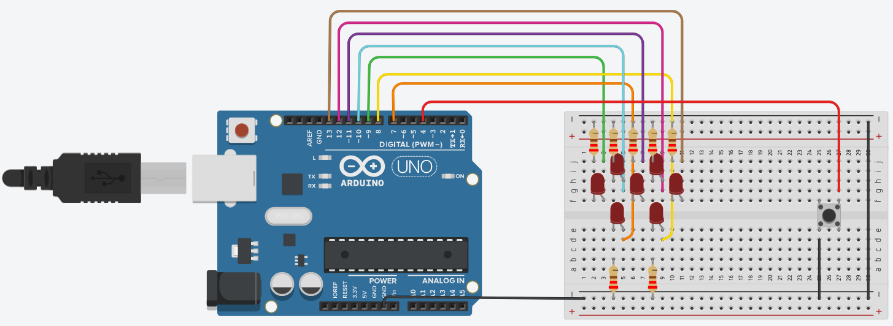

# Whack-A-LED

This repository is a project that I had to do in my University course called Tecnologia da Informática (Computer Technology). It's a simple copy of the game Wack a Mole in [Arduino](https://www.arduino.cc/), but instead of smashing moles, you press a button when a LED is on.

Because this was made in a Portuguese University, the code, variable names and comments are all in Portuguese.

## How to setup the game

Copy the following diagram. You will need:
- 1 Arduino Uno
- 1 breadboard
- 1 button
- 7 LEDs
- 7 220 ohm resistors
- 11 cables

  

## How the game works

When you upload the [WhackALed.ino](https://github.com/TomAintAround/WhackALed/blob/main/WhackALed.ino) file to the Arduino, the LEDs are turned off and the game hasn't begun yet. To start it, you need to press the button for 2 seconds and the LEDs will blink 3 times. Then the game really starts.

The LEDs will start turning on randomly and when you press the button while a LED is on, it will remain on. The game ends when all LEDs are on. They will blink 3 times and then turn off. The game is now back to the state when you uploaded the .ino file.

You can also reset the game back to the initial state by pressing the button for 2 seconds. The LEDs will blink twice this time.
